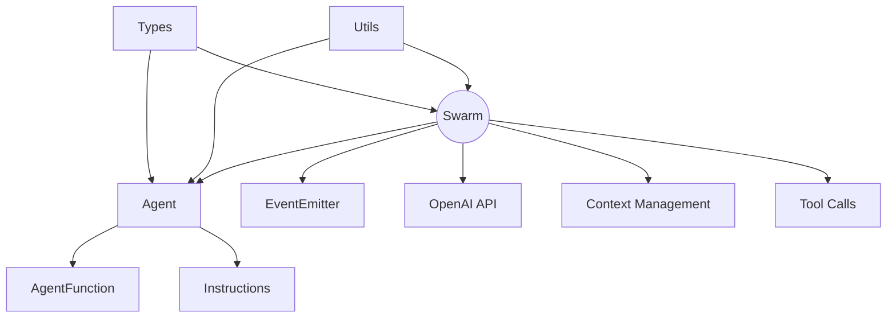
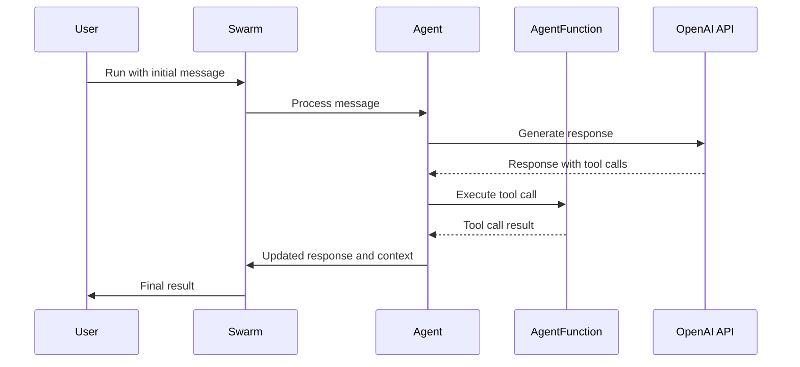

# Architecture

Swarm focuses on making agent coordination and execution lightweight, highly controllable, and easily testable.

## Core Components

1. **Swarm**: The main orchestrator that manages agents and their interactions.
2. **Agent**: Represents an AI agent with specific capabilities and instructions.
3. **AgentFunction**: Defines the structure and behavior of functions that agents can use.

## High-Level Overview

TS-SWARM follows a modular architecture that allows for easy extension and customization. The project is structured as follows:

## Example Sequence Flow

Here's a simplified sequence diagram showing how the components interact in a typical scenario:

1. The user initiates a request to the Swarm with an initial message.
2. The Swarm passes the message to the appropriate Agent.
3. The Agent processes the message and uses the OpenAI API to generate a response.
4. If the response includes tool calls, the Agent executes the corresponding AgentFunctions.
5. The Agent updates its response and context based on the tool call results.
6. The Swarm returns the final result to the user.

This process can repeat multiple times, with the Swarm managing context and potentially switching between different specialized Agents as needed.
