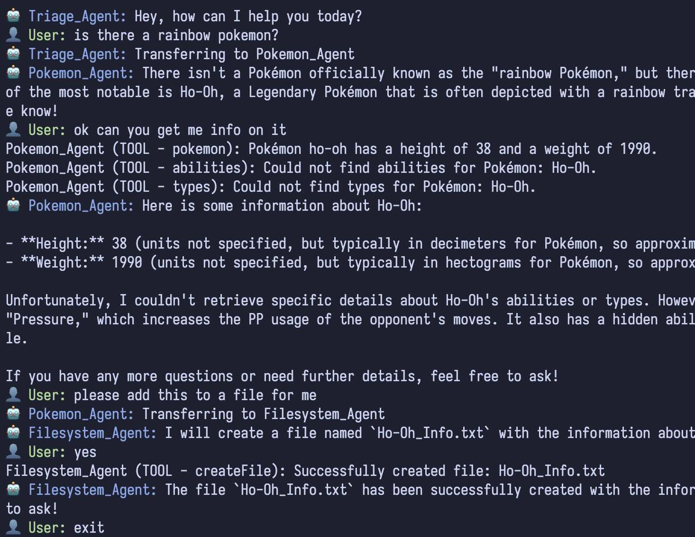

# TS-SWARM 🐝

[](https://www.npmjs.com/package/ts-swarm)
[](https://openai.com/)
[](https://www.typescriptlang.org/)
[](https://opensource.org/licenses/MIT)

## Overview

TS-SWARM is a minimal TypeScript Agentic library mixing the simplicity of [OpenAI Swarm API](https://github.com/openai/swarm) with the flexibility of the [Vercel AI SDK](https://github.com/vercel/ai).

## Features

- **Multi-Agent System**: Create and manage multiple AI agents with different roles and capabilities.
- **Flexible Agent Configuration**: Easily define agent behaviors, instructions, and available functions.
- **Task Delegation**: Agents can transfer tasks to other specialized agents.
- **Tools**: Agents can use tools to perform tasks.
- **Zod Validation**: Tools can use zod validation to ensure the input is correct.
- **Model Choice**: Easily switch between different LLMs by changing a single line of code.

## Examples

- [Filesystem Agent](./examples/filesystem/filesystemAgent.ts)
- [Pokemon Agent](./examples/pokemon/pokemonAgent.ts)
- [Triage Weather Email Agents](./examples/triage-weather-email/index.ts)
- [All Agents](./examples/all/index.ts)

Run scripts of the examples can be found in the package.json :)



## Installation

You will need Node.js 18+ and pnpm installed on your local development machine.

```bash
pnpm add ts-swarm
```

## Usage

> [!TIP]
> The `createAgent` util is a thin wrapper over [`generateText` from the Vercel AI SDK](https://sdk.vercel.ai/docs/reference/ai-sdk-core/generate-text). You have access to the full power of the Vercel AI SDK at your disposal including **tools**, **zod validation**, and **model choice**. ⚡

```typescript
import { createAgent, Swarm, transferToAgent } from 'ts-swarm';
import { openai } from '@ai-sdk/openai'; // Ensure OPENAI_API_KEY environment variable is set
import { tool } from 'ai';
import { z } from 'zod';

// Create the Weather Agent
const weatherAgent = createAgent({
  id: 'Weather_Agent',
  model: openai('gpt-4o-mini'),
  system: `You are a weather assistant. Your role is to:
- Provide weather information for requested locations
- Use the weather tool to fetch weather data
- Respond in a friendly, conversational manner`,
  tools: {
    weather: tool({
      description: 'Get the weather for a specific location',
      parameters: z.object({
        location: z.string().describe('The location to get weather for'),
      }),
      execute: async ({ location }) => {
        // Mock weather API call
        return `The weather in ${location} is sunny with a high of 67°F.`;
      },
    }),
  },
});

// Create the Triage Agent
const triageAgent = createAgent({
  id: 'Triage_Agent',
  model: openai('gpt-4o-mini'),
  system: `You are a helpful triage agent. Your role is to:
- Determine if the user's request is weather-related
- If weather-related, use transferToWeather_Agent to hand off the conversation
- For non-weather queries, explain that you can only help with weather information`,
  tools: {
    // Add ability to transfer to weather agent
    ...transferToAgent(weatherAgent),
  },
});

// Add ability for weather agent to transfer back to triage agent if needed
weatherAgent.tools = {
  ...weatherAgent.tools,
  ...transferToAgent(triageAgent),
};

async function demo() {
  // Initialize swarm with our agents
  const swarm = new Swarm({
    agents: [triageAgent, weatherAgent],
  });

  // Example conversation
  const messages = [
    { role: 'user' as const, content: "What's the weather like in New York?" },
  ];

  // Run the swarm
  const result = await swarm.run({
    agent: triageAgent,
    messages,
  });

  // Log the last message (or the entire conversation if you prefer)
  const lastMessage = result.messages[result.messages.length - 1];
  console.log(
    `${lastMessage.swarmMeta?.agentId || 'User'}: ${lastMessage.content}`,
  );
}

demo();
// Query: What's the weather like in New York?
// Result: The weather in New York is sunny with a high of 67°F.
```

The following diagram demonstrates the usage above. A simple multi-agent system that allows for delegation of tasks to specialized agents.


To see more examples, check out the [examples](./examples) directory.

Otherwise, for more examples please refer to the original openai repo: [swarm](https://github.com/openai/swarm)

The primary goal of Swarm is to showcase the handoff & routines patterns explored in the [Orchestrating Agents: Handoffs & Routines cookbook](https://cookbook.openai.com/examples/orchestrating_agents)

## Contributing

We welcome contributions to TS-SWARM! If you'd like to contribute, please see [CONTRIBUTING.md](./CONTRIBUTING.md) for more information.

## Troubleshooting

If you encounter any issues while using TS-SWARM, try the following:

1. **Runtime Errors**: Enable debug mode by setting `debug: true` in the `swarm.run()` options to get more detailed logs.

If you're still experiencing issues, please [open an issue](https://github.com/joshmu/ts-swarm/issues) on the GitHub repository with a detailed description of the problem and steps to reproduce it.

## Acknowledgements

It goes without saying that this project would not have been possible without the original work done by the OpenAI & Vercel teams. :) Go give the [Swarm API](https://github.com/openai/swarm) & [Vercel AI SDK](https://github.com/vercel/ai) a star! ⭐

## License

This project is licensed under the MIT License - see the [LICENSE](./LICENSE) file for details.
