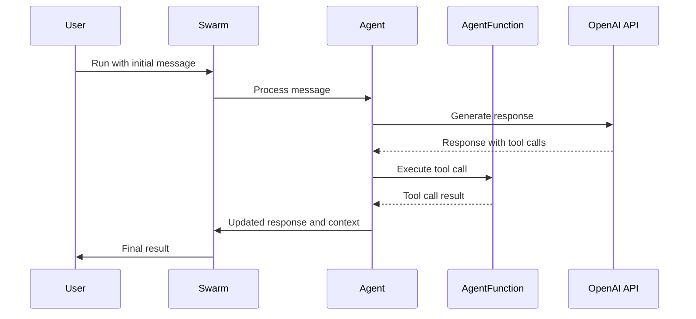

# TS-SWARM

[](https://www.typescriptlang.org/)
[](https://openai.com/)
[](https://opensource.org/licenses/MIT)

## Overview

TS-SWARM is a minimal TypeScript Agentic library inspired by the OpenAI Swarm API. It provides a flexible and extensible system for creating and managing AI agents that can collaborate, communicate, and solve complex tasks.

## Features

- **Multi-Agent System**: Create and manage multiple AI agents with different roles and capabilities.
- **Flexible Agent Configuration**: Easily define agent behaviors, instructions, and available functions.
- **Task Delegation**: Agents can transfer tasks to other specialized agents.
- **Streaming Responses**: Support for real-time streaming of agent responses.
- **Context Management**: Maintain and update context variables across agent interactions.
- **Event System**: Built-in event emitter for tracking agent switches and tool calls.
- **TypeScript Support**: Fully typed for better development experience and code quality.

## Installation

You will need Node.js 18+ and pnpm installed on your local development machine.

```bash
pnpm add ts-swarm
```

## Usage

To use TS-SWARM in your project, import the necessary components:

```typescript
import { Swarm, Agent, AgentFunction } from 'ts-swarm';
```

Then, create agents and define their functions:

```typescript
const weatherAgent = new Agent({
  name: 'Weather Agent',
  instructions: 'You are a weather assistant.',
  functions: [getWeather],
});

const swarm = new Swarm(process.env.OPENAI_API_KEY);

// Run the swarm
const result = await swarm.run({
  agent: weatherAgent,
  messages: [{ role: 'user', content: "What's the weather like in New York?" }],
});
```

## Architecture

TS-SWARM follows a modular architecture that allows for easy extension and customization.

### Core Components

1. **Swarm**: The main orchestrator that manages agents and their interactions.
2. **Agent**: Represents an AI agent with specific capabilities and instructions.
3. **AgentFunction**: Defines the structure and behavior of functions that agents can use.

### Example Sequence Flow

Here's a simplified sequence diagram showing how the components interact in a typical scenario:



1. The user initiates a request to the Swarm with an initial message.
2. The Swarm passes the message to the appropriate Agent.
3. The Agent processes the message and uses the OpenAI API to generate a response.
4. If the response includes tool calls, the Agent executes the corresponding AgentFunctions.
5. The Agent updates its response and context based on the tool call results.
6. The Swarm returns the final result to the user.

This process can repeat multiple times, with the Swarm managing context and potentially switching between different specialized Agents as needed.

For more information on the architecture, see our [ARCHITECTURE.md](./ARCHITECTURE.md).

## Contributing

We welcome contributions to TS-SWARM! If you'd like to contribute, please see our [CONTRIBUTING.md](./CONTRIBUTING.md) for more information.

## Troubleshooting

If you encounter any issues while using TS-SWARM, try the following:

1. **Runtime Errors**: Enable debug mode by setting `debug: true` in the `swarm.run()` options to get more detailed logs.

If you're still experiencing issues, please [open an issue](https://github.com/joshmu/ts-swarm/issues) on the GitHub repository with a detailed description of the problem and steps to reproduce it.

## License

This project is licensed under the MIT License - see the [LICENSE](./LICENSE) file for details.
