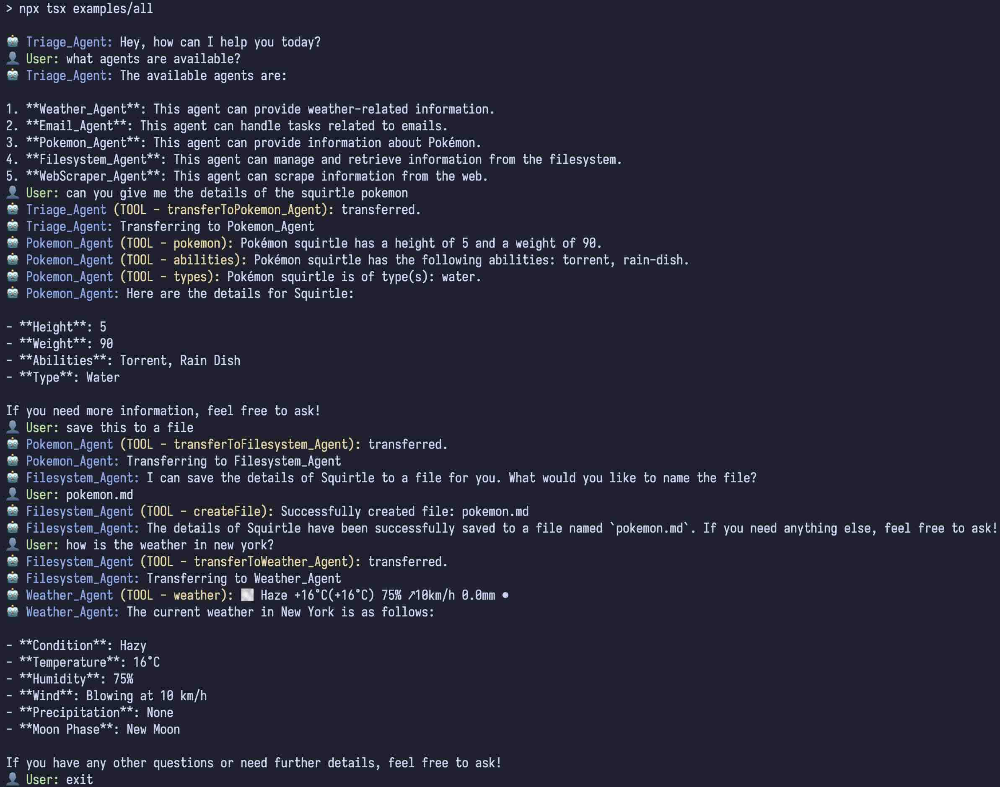

# TS-SWARM 🐝

[](https://www.npmjs.com/package/ts-swarm)

[](https://www.typescriptlang.org/)
[](https://opensource.org/licenses/MIT)

## Overview

TS-SWARM is a minimal TypeScript Agentic library mixing the simplicity of [OpenAI Swarm API](https://github.com/openai/swarm) with the flexibility of the [Vercel AI SDK](https://github.com/vercel/ai).

## Features

- **Minimal Interface**: `createAgent` & `<agent>.run()`, that's it!
- **Multi-Agent System**: Create and manage multiple AI agents with different roles and capabilities.
- **Flexible Agent Configuration**: Easily define agent behaviors, instructions, and available functions.
- **Task Delegation**: Agents can transfer tasks to other specialized agents.
- **Tools**: Agents can use tools to perform tasks.
- **Zod Validation**: Tools can use zod validation to ensure the input is correct.
- **Model Choice**: Easily switch between different LLMs by changing a single line of code.
- **Local Agents**: Option to run locally with the [ollama-ai-provider](https://sdk.vercel.ai/providers/community-providers/ollama).

## Examples

Some examples of agents and agentic patterns, additionally take a look at [`examples/run.ts`](./examples/run.ts) on how to have a conversation with agents.

- [Local Agent with Ollama](./examples/local/localAgent.ts)
- [Pokemon Agent](./examples/pokemon/pokemonAgent.ts)
- [Web Scraper Agent](./examples/webscraper/webScraperAgent.ts)
- [Filesystem Agent](./examples/filesystem/filesystemAgent.ts)
- [Triage Weather Email Agents](./examples/triage-weather-email/index.ts)
- [All Agents Connected](./examples/all/index.ts)

> [!TIP]
> Grab the repo and invoke the examples via scripts provided in the [package.json](./package.json) :)

Demo using the [All Agents Connected](./examples/all/index.ts) example:


## Installation

Use your preferred package manager:

```bash
pnpm add ts-swarm ai zod
```

Depending on the LLM you want to use via the Vercel AI SDK, you will need to install the appropriate package.

**Run via an LLM provider service** such as OpenAI:

```bash
# OpenAI - Ensure OPENAI_API_KEY environment variable is set
pnpm add @ai-sdk/openai
```

**Or run locally** with [ollama-ai-provider](https://sdk.vercel.ai/providers/community-providers/ollama):

```bash
# Ollama - Ensure you leverage a model that supports tool calling
pnpm add ollama-ai-provider
```

## Usage

TS-SWARM is kept minimal and simple. `createAgent` will create agents. Once you have your agent, `<your-agent>.run()` method will orchestrate the swarm conversation allowing for tool calling and agent handoffs.

> [!TIP]
> The `createAgent` util is a thin wrapper over [`generateText` from the Vercel AI SDK](https://sdk.vercel.ai/docs/reference/ai-sdk-core/generate-text). Thus you have access to **tools**, **zod validation**, and **model choice**. ⚡

```typescript
import { createAgent } from 'ts-swarm';
import { openai } from '@ai-sdk/openai'; // Ensure OPENAI_API_KEY environment variable is set
import { z } from 'zod';

// Create the Weather Agent
const weatherAgent = createAgent({
  id: 'Weather_Agent',
  model: openai('gpt-4o-2024-08-06', { structuredOutputs: true }),
  system: `
    You are a weather assistant. 
    Your role is to:
      - Provide weather information for requested locations
      - Use the weather tool to fetch weather data`,
  tools: [
    {
      id: 'weather',
      description: 'Get the weather for a specific location',
      parameters: z.object({
        location: z.string().describe('The location to get weather for'),
      }),
      execute: async ({ location }) => {
        // Mock weather API call
        return `The weather in ${location} is sunny with a high of 67°F.`;
      },
    },
  ],
});

// Create the Triage Agent
const triageAgent = createAgent({
  id: 'Triage_Agent',
  model: openai('gpt-4o-2024-08-06', { structuredOutputs: true }),
  system: `
    You are a helpful triage agent. 
    Your role is to:
      - Answer the user's questions by transferring to the appropriate agent`,
  tools: [
    // Add ability to transfer to the weather agent
    weatherAgent,
  ],
});

async function demo() {
  /**
   * Run the triage agent with swarm orchestration
   * Enabling tool calling and agent handoffs
   */
  const result = await triageAgent.run({
    // Example conversation passed in
    messages: [
      { role: 'user', content: "What's the weather like in New York?" },
    ],
  });

  /**
   * We could wrap this logic in a loop to continue the conversation by
   * utilizing `result.activeAgent` which represents the last active agent during the run
   * For this example `result.activeAgent` would now be the weather agent
   * Refer to the `run.ts` example for an example of this
   */

  // Log the last message (or the entire conversation if you prefer)
  const lastMessage = result.messages.at(-1);
  console.log(
    `${lastMessage?.swarmMeta?.agentId || 'User'}: ${lastMessage?.content}`,
  );
}

demo();
// Query: What's the weather like in New York?
// Triage_Agent: transferring...
// Result: Weather_Agent: The weather in New York is sunny with a high of 67°F.
```

The following diagram demonstrates the usage above. A simple multi-agent system that allows for delegation of tasks to specialized agents.


To see more examples, check out the [examples](./examples) directory.

Otherwise, for more examples please refer to the original openai repo: [swarm](https://github.com/openai/swarm)

The primary goal of Swarm is to showcase the handoff & routines patterns explored in the [Orchestrating Agents: Handoffs & Routines cookbook](https://cookbook.openai.com/examples/orchestrating_agents)

## createAgent()

`createAgent` defines your agent. It's a thin wrapper over [`generateText` from the Vercel AI SDK](https://sdk.vercel.ai/docs/reference/ai-sdk-core/generate-text).

### Arguments

| Argument | Type                          | Description                                                                                                         | Default    |
| -------- | ----------------------------- | ------------------------------------------------------------------------------------------------------------------- | ---------- |
| id       | `string`                      | Unique identifier for the agent (must match `/^[a-zA-Z0-9_-]+$/`)                                                   | (required) |
| model    | `LanguageModelV1`             | Refer to [Providers and Models from the Vercel AI SDK](https://sdk.vercel.ai/docs/foundations/providers-and-models) | (required) |
| tools    | `SwarmTool[]`                 | Array of core tools or agents to transfer to                                                                        | `[]`       |
| ...rest  | `Partial<GenerateTextParams>` | Refer to [`generateText` from the Vercel AI SDK](https://sdk.vercel.ai/docs/reference/ai-sdk-core/generate-text)    | `{}`       |

### Returns

Returns an `Agent` object containing:

- `id`: Agent's unique identifier
- `generate`: Function to generate a response
- `run`: **Function to run the agent with swarm orchestration allowing for tool calls and agent transfers**
- `tools`: Array of available tools

## agent.run()

The `<agent>.run()` method handles the LLM request loop through an agent-based system, managing tool calls and agent handoffs.

### Arguments

| Argument    | Type                            | Description                                               | Default       |
| ----------- | ------------------------------- | --------------------------------------------------------- | ------------- |
| messages    | `Message[]`                     | Array of llm message objects with optional swarm metadata | (required)    |
| activeAgent | `Agent`                         | option to override the current active agent to be called  | current agent |
| onMessages  | `(messages: Message[]) => void` | Callback when new messages are received                   | `undefined`   |
| debug       | `boolean`                       | Enables debug logging when true                           | `false`       |
| maxTurns    | `number`                        | Maximum number of conversational turns allowed            | `10`          |

### Returns

Returns a `SwarmResult` object containing:

- `messages`: Array of llm messages from the conversation
- `activeAgent`: Current active agent on completion of the run (useful for continuing the conversation)

## runSwarmLoop()

The `runSwarmLoop` function is a convenience function to allow you to test your agents in the terminal. It's a simple while loop that continues to run until the user decides to 'exit'. It is what is used in most of the examples and the source code can be viewed in [`examples/run.ts`](./examples/run.ts).

### Arguments

| Argument            | Type     | Description                                                                 |
| ------------------- | -------- | --------------------------------------------------------------------------- |
| initialAgentMessage | `string` | The initial message from the agent to the user to commence the conversation |
| initialAgent        | `Agent`  | The initial agent to start the conversation with                            |

## Roadmap

- [ ] Support streaming
- [ ] Additional context passing
- [ ] Provide agentic design pattern examples
- [ ] More test coverage
- [ ] Bash the bugs
- [ ] Continue to find as much simplicity while maintaining flexibility :)

## Contributing

We welcome contributions to TS-SWARM! If you'd like to contribute, please see [CONTRIBUTING.md](./CONTRIBUTING.md) for more information.

## Troubleshooting

If you're experiencing issues, please [open an issue](https://github.com/joshmu/ts-swarm/issues) on the GitHub repository with a detailed description of the problem and steps to reproduce it.

## Acknowledgements

It goes without saying that this project would not have been possible without the original work done by the OpenAI & Vercel teams. :) Go give the [Swarm API](https://github.com/openai/swarm) & [Vercel AI SDK](https://github.com/vercel/ai) a star! ⭐

## License

This project is licensed under the MIT License - see the [LICENSE](./LICENSE) for details.
